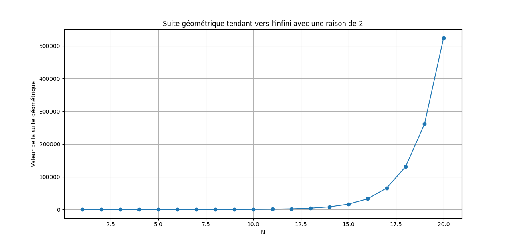
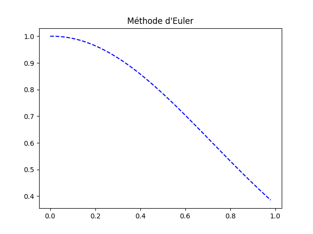
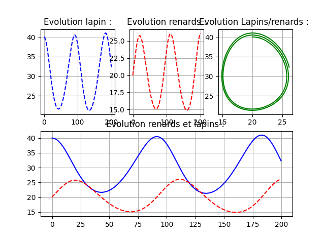
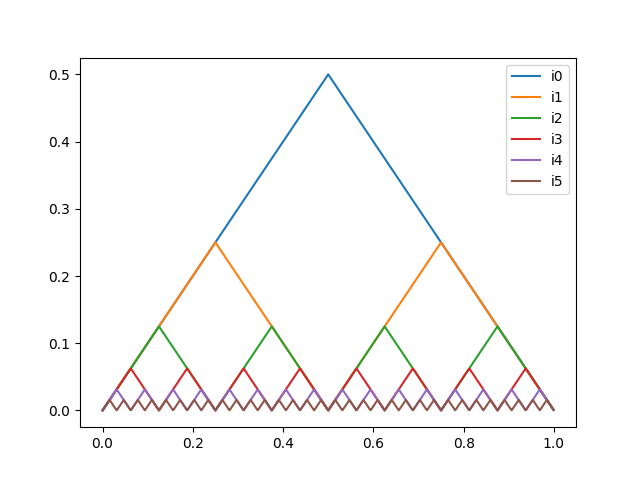
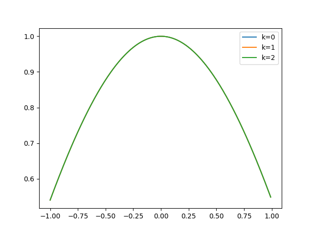

# math_problem_solving_python
An archive of Python scripts from my CPGE MPSI-MP years, exploring numerical analysis, differential equations, and algorithmic problem-solving.

# CPGE MP - Mathematical Problem Solving & Numerical Analysis

Welcome to this repository ! This project is an archive of various numerical analysis and mathematical problem-solving scripts I developed during my two years of intensive preparation in mathematics and physics (CPGE MPSI-MP). 

I have a deep passion for problem-solving and algorithmic thinking. These scripts highlight my journey in translating abstract mathematical concepts—such as recursive sequences, differential equations, and integral operators—into functional Python code.

##  Technologies & Libraries
* **Language:** Python
* **Libraries:** `NumPy`, `Matplotlib`, `SciPy`

## 📂 Repository Contents

Here is a breakdown of the mathematical problems explored in this repository:

### 1. Numerical Sequences & Convergence (`Les_suites_numeriques.py`)
* Implements algorithms to evaluate explicit and recursive sequences of the form $u_{n+1} = f(u_n)$.
* Contains threshold algorithms (using `while` loops) to numerically determine the limits of sequences converging to infinity or a finite limit $\ell$.
* Includes graphical visualizations of geometric sequences and the convergence of $u_n = \frac{1}{n}$

.

### 2. Differential Equations & Euler's Method (`resolution_par_methodes_numeriques.py`)

* Demonstrates the resolution of first-order differential equations using the Euler method.
* Compares numerical approximations against exact analytical solutions.
* Extends the method to a 2D system to model population dynamics, specifically implementing the Lotka-Volterra equations (predator-prey model for rabbits and foxes).

 
 

### 3. Euler Polynomials Generation (`polynome2.py`)
* Uses `numpy.polynomial` to recursively generate Euler polynomials.
* Implements the recursive definition utilizing polynomial integration (`P.integ()`) to compute the coefficients dynamically.
* Plots the resulting polynomial curves for different iterations.

### 4. Recursive Functions & Fractal Curves (`suite_de_fonction.py`)
* Defines a continuous, piecewise linear function (triangle wave) $\Delta(x)$.
* Constructs a highly recursive function $d(n, x)$ and evaluates the sum $S(x)$ to plot complex, non-differentiable continuous curves (similar to the Takagi/Blancmange curve).

  

### 5. Iterative Integral Operators (`integration.py`)
* Explores functional analysis by implementing an integral operator $T(f, x) = 1 - \int_0^x (x-t)f(t) dt$ using `scipy.integrate.quad`.
* Applies this operator iteratively to standard functions like the exponential and cosine functions.
* Visualizes the transformation of the functions over multiple iterations.

## 💡 Why this repository?
This repository serves as a personal time capsule of my CPGE years. It reflects my core interest in taking rigorous, theoretical math problems and solving them computationally. Feel free to explore the code!
